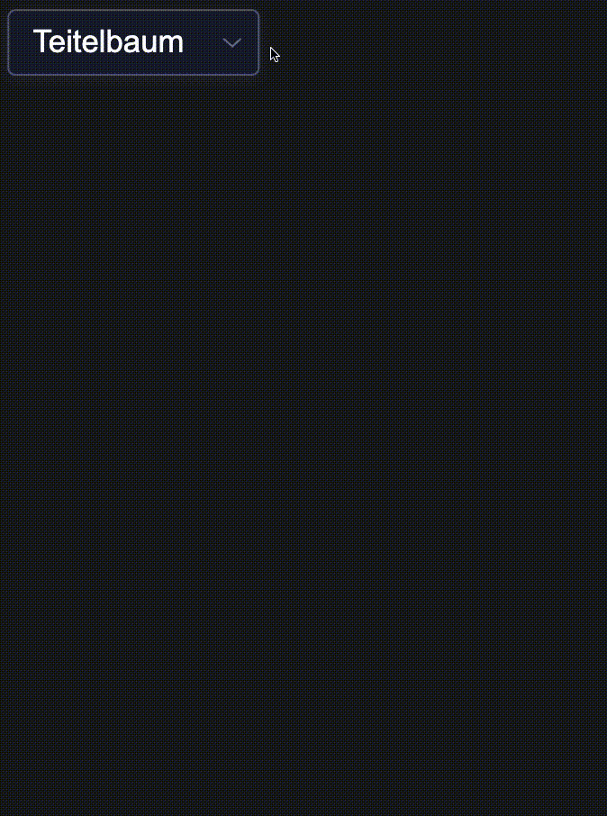
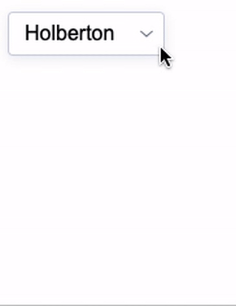
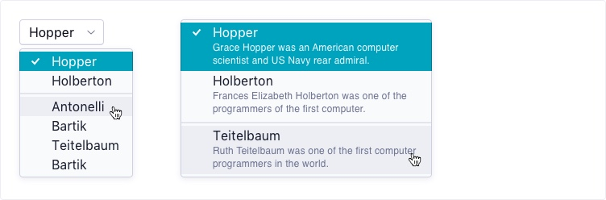

# React Select Menu

Yet another React Select Component

# Table Of Contents

- ## [Installation](#installation)
- ## [GIF](#gif)
- ## [Usage](#usage)
- ## [Props](#props)

# Installation

`npm i github:T410/react-select-menu`

# GIF

Dark Mode & Detailed View



<br/>
<br/>

Light Mode & Simple View



# Usage

```js
import { SelectMenu } from "react-select-menu";

function App() {
	return (
		<div>
			<SelectMenu
				options={[
					{
						name: "Hopper",
						value: "hopper",
						description: "Grace Hopper was an American computer scientist and US Navy rear admiral.",
						groupID: 2,
					},
					{
						name: "Holberton",
						value: "holberton",
						description: "Frances Elizabeth Holberton was one of the programmers of the first computer.",
						groupID: 2,
					},
					{
						name: "Teitelbaum",
						value: "teitelbaum",
						description: "Ruth Teitelbaum was one of the first computer programmers in the world",
						groupID: 1,
					},
					{
						name: "Tayyib",
						value: "tayyib",
						description: "Hey, it's me!",
					},
					{
						name: "No Description",
						value: "noDesc",
						groupID: 3,
					},
				]}
				defaultValue={"teitelbaum"}
				isSimple={false}
				darkMode={true}
				maxWidth={300}
				onChange={(e) => {
					console.log(e);
				}}
			/>
		</div>
	);
}
```

<br/>

# Example

You can find the example index.js [here](src/index.js)
To run it on your machine, simply clone this repo <code>git clone https://github.com/T410/react-select-menu.git</code> cd into the directory as such <code>cd react-select-menu</code> and then run <code>npm i</code> to install the dependencies.

Then you can run <code>npm start</code> in the project directory to run the example project. You will see which port the project will run on.

# Props

| Name           | Type                                                                                      | Default                                                          | Returns         | Description                                                                                                                                                                           |
| -------------- | ----------------------------------------------------------------------------------------- | ---------------------------------------------------------------- | --------------- | ------------------------------------------------------------------------------------------------------------------------------------------------------------------------------------- |
| `options`      | `[{ name: String\|Number, value: String\|Number, description: String, groupID: Number }]` |                                                                  |                 | `name` and `value` are required. If you pass `groupID` then every object that has the same groupID will be visibly grouped together. Note that options will be sorted by the groupID. |
| `defaultValue` | `String\|Number`                                                                          | `value` of the first option after sorting the options by groupID |                 |                                                                                                                                                                                       |
| `isSimple`     | `Boolean`                                                                                 | `true`                                                           |                 |                                                                                                                                                                                       |
| `darkMode`     | `Boolean`                                                                                 | `false`                                                          |                 |                                                                                                                                                                                       |
| `maxWidth`     | `Number`                                                                                  | `300`                                                            |                 | This is the max-width style of the dropdown window.                                                                                                                                   |
| `onChange`     | `Function`                                                                                | `()=>{}`                                                         | `option` object | This callback will be called when the user selects "a new option".                                                                                                                    |

<br/>
<br/>
<br/>
<br/>
<br/>
<br/>
<br/>

# Design System challenge

Welcome to our exercise. During this test, you will be given the challenge to create a Select Menu component from scratch using React.

If you have any questions, please contact us for clarification, we're happy to help!



## Instructions

1. **Clone** this repo to a location of your choosing.
2. Write your solution to the exercise, making sure you followed the specs carefully.
3. Push your solution to a **private repo** in your **personal Github account**.
4. When you are ready for us to take a look, add the user `adjust-frontend` as a collaborator to your repo.

## Exercise

Using the provided [specs](specs.png), create a reusable `Select Menu` component. For this exercise, we ask you to implement your own component and not use any ready solutions, like react-select, Material UI, etc.

- Your component should be written in React.
- You can choose between Javascript or Typescript.
- You can choose how to style your component.

### Bonus

- You can choose how to test your component.

## Expected result

We expect you to create a **reusable** component that can be easily integrated into any project.

Don't forget to add a documentation page with examples of the different use cases of your component, including instructions on how to use it and how to run your project locally.

Remember, the closer your component looks in comparison to the specs, the better 🙂

Good luck!
